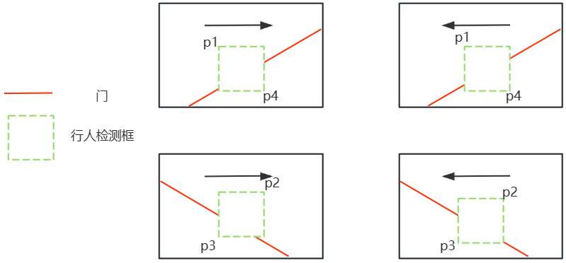

# visualNetworking_erkai(二开视联网项目)
## 视觉模型
### 选用模型  ->  reid
### 模型输入  ->  视频流
### 模型输出
```json```
<br>{<br>
  &emsp;"timestamp": 1634567890.123,<br>
  &emsp;"camera_id": "cam_001",<br>
  &emsp;"detections": [<br>
    &emsp;&emsp;{<br>
     &emsp;&emsp;&emsp; "bbox": [100, 150, 200, 400], &ensp;//[x1, y1, x2, y2]<br>
      &emsp;&emsp;&emsp; "track_id": 101,<br>
      &emsp;&emsp;&emsp; "confidence": 0.95,<br>
      &emsp;&emsp;&emsp; "features": [0.12, -0.45, 0.88, ...], //&ensp;长达数百维的向量<br>
      &emsp;&emsp;&emsp; "attributes": {<br>
        &emsp;&emsp;&emsp;&emsp;"gender": "male",<br>
        &emsp;&emsp;&emsp;&emsp;"upper_color": "blue",<br>
        &emsp;&emsp;&emsp;&emsp;"has_backpack": true<br>
      &emsp;&emsp;&emsp; }<br>
    &emsp;&emsp;},<br>
    &emsp;&emsp;{<br>
      &emsp;&emsp;&emsp;"bbox": [300, 120, 380, 370],<br>
      &emsp;&emsp;&emsp;"track_id": 102,<br>
      &emsp;&emsp;&emsp;"confidence": 0.87,<br>
      &emsp;&emsp;&emsp;"features": [-0.34, 0.67, 0.11, ...],<br>
      &emsp;&emsp;&emsp;"attributes": {<br>
        &emsp;&emsp;&emsp;&emsp;"gender": "female",<br>
        &emsp;&emsp;&emsp;&emsp;"upper_color": "red",<br>
        &emsp;&emsp;&emsp;&emsp;"has_backpack": false<br>
      &emsp;&emsp;&emsp;}<br>
    &emsp;&emsp;}<br>
  &emsp;]<br>
}<br>
```json```
## 数据处理
1. map（映射处理）<br>
将数据处理为以**track_id**为key，以**识别框x1**位置列表为value的map<br>
```json```
{<br>
    &emsp;"track_id1":&ensp;["x_11","x_12","x_13",...,"x_1n"],<br>
    &emsp;"track_id2":&ensp;["x_21","x_22","x_23",...,"x_2n"],<br>
    &emsp;...<br>
}
```json```<br>
2. 白名单设置
以**集合Set**形式存储店员的track_id，实现高效白名单查找，时间复杂度**O（1）**
* 存储形式，采用文件存储或Redis持久化存储<br>
```python```<br>
white_list_set = {white_track_id1, white_track_id2, ... ,white_track_idn}<br>
if id **in** white_list_set:<br>
   &emsp;// 店员<br>
else:<br>
   &emsp;// 不是店员<br>
```python```<br>
3. 进出门逻辑
* 设置门的位置，及进门方向，left or right
* 查找每个识别框列表中的单调序列，递增大于阈值为进门，递减小于阈值为出门（或相反，门的状态）
4. 进门情况示意图<br>
